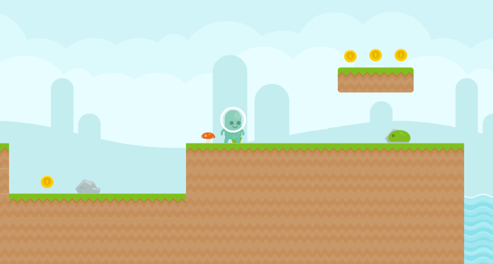
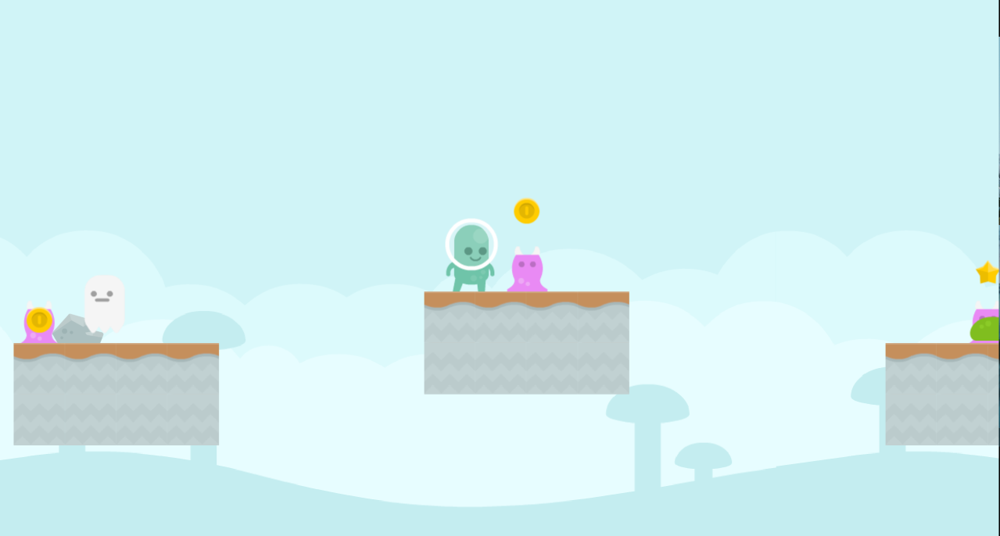

# Platformer
Play the game here: https://sp4r0w.itch.io/platformer

### About
-------------
This is my first true game made in Godot v3.5.1. It was made using C# and it features 5 short levels, each with unique setting and different enemies.   
It's perfect for speedrunning and an optional speedruning mode with more precise time tracking is available in the settings.  
Please note that some may find this game challenging and indeed, it never was meant to be too easy. Especially the last level. And believe me, it used to be way, way worse.

#### WARNING !
Please note that this was my first true game in C# and in no way this code will ever be perfect. I didn't know about many things at the time that I should have used (like enums for states, scene inheritance, etc.)  
I did some small clean up and added comments but I haven't made any significant changes to the code.  
I upload this repo and preserve the game for me to look at how much I improve over time. Improving the code now, with my current knowledge defeats the point.  
However, you're free to improve upon this code if you wish to do so :)

### Getting Started
-------------
To compile this project, you will need at least Godot Mono v3.5.1. Do not forget you will need the required export templates.   
More in-depth guide is avaiable here: https://docs.godotengine.org/en/stable/tutorials/export/exporting_projects.html  
You're free to modify the project as you wish.

### Credits
-------------
Thanks to DipShtick (Varga) for testing.  
Graphical assets were made by Kenney (https://kenney.nl/)  
Music was made by joshuuu (https://joshuuu.itch.io/)  
Alternate soundtrack is from Clustertruck game composed by Karl Flodin (https://karlflodin.bandcamp.com/album/clustertruck-ost)

### Preview
-------------

Play the game here: https://sp4r0w.itch.io/platformer
