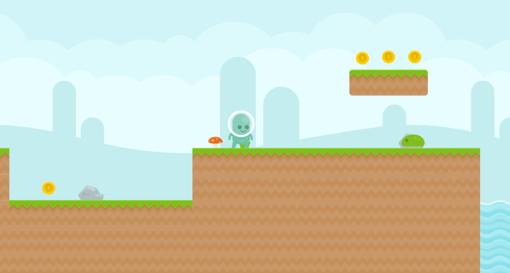
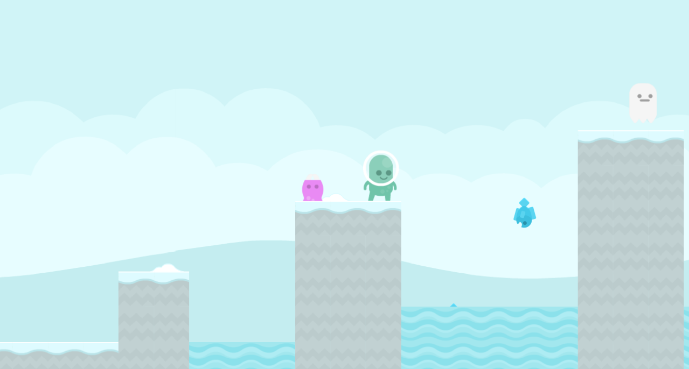

# Platformer
Play the game here: https://sp4r0w.itch.io/platformer

### About
-------------
This is my first true game made in Godot v3.5.1. It was made using C# and it features 5 short levels, each with unique setting and different enemies.   This game is perfect for speedrunning and an optional speedruning mode is available in the settings.

### Getting Started
-------------
To compile this project, you will need at least Godot Mono v3.5.1. Do not forget you will need the required export templates.   
More in-depth guide is avaiable here: https://docs.godotengine.org/en/stable/tutorials/export/exporting_projects.html  
You're free to modify the project as you wish.

### Credits
-------------
Thanks to DipShtick (Varga) for testing.  
Graphical assets were made by Kenney (https://kenney.nl/)  
Music was made by joshuuu (https://joshuuu.itch.io/)  
Alternate soundtrack is from Clustertruck game composed by Karl Flodin (https://karlflodin.bandcamp.com/album/clustertruck-ost)

### Preview
-------------

Play the game here: https://sp4r0w.itch.io/platformer
